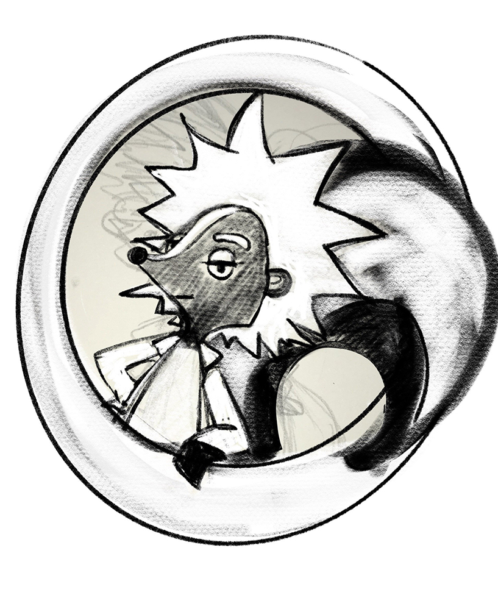

# H2O Workshop for NEU AI Skunkworks


```bash 

sudo pip uninstall h2o
sudo pip install -f http://h2o-release.s3.amazonaws.com/h2o/latest_stable_Py.html h2o

```

Some of these tutorials are modifications and extensions of H2O AI's learning materials from [https://github.com/h2oai/h2o-tutorials](https://github.com/h2oai/h2o-tutorials) 


To do:

Add notebooks on:

* K local interpretable model-agnostic explanations (K-LIME)    
* Individual conditional expectation (ICE) plots    
* Leave-one-covariate-out (LOCO) local feature importance     
* Visualization of neural network layers    
* Decision tree surrogate models   


## About NEU AI Skunkworks

NEU AI Skunkworks Mission & Creed

NEU AI Skunkworks is a group of people who research and develop Artificial Intelligence, Machine Learning, and Deep Learning projects primarily for the sake of innovation and learning. We provide open-mic, mentorship, workshops, seminars, hack-a-thons, and events that assist those exploring the edges of AI.

Rules
* Have a growth and innovative mindset  
* Be passionate about something  
* Educate yourself and others  
* Be an active member  
* Respect your peers  
* Be skunky  


